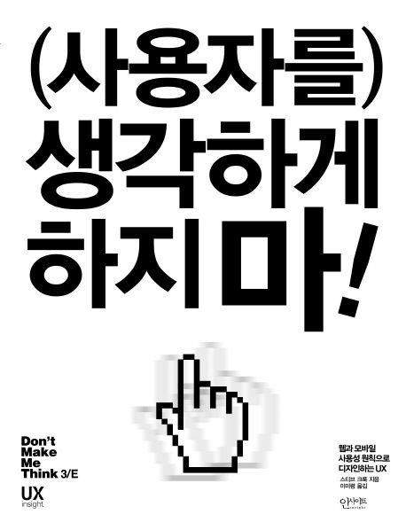
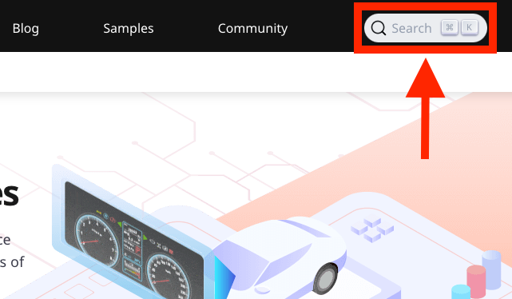
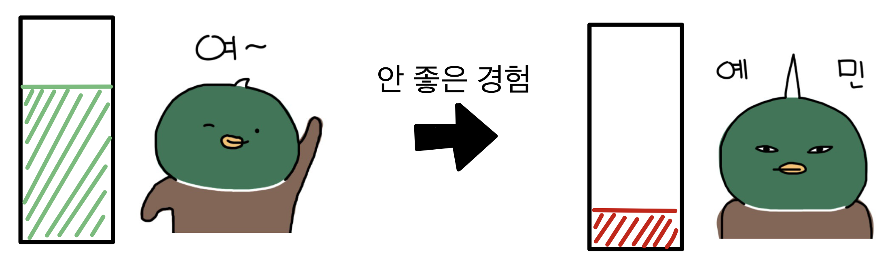

# (사용자를) 생각하게 하지 마!

스티브 크룩의 저서 <[(사용자를) 생각하게 하지 마! 3판](https://product.kyobobook.co.kr/detail/S000001033002)>(*원제: Don't Make Me Think*)을 읽고 흥미로운 점을 정리한다.

**Table of Contents**

- [(사용자를) 생각하게 하지 마!](#사용자를-생각하게-하지-마)
  - [사용자는 극히 적은 시간을 투자한다](#사용자는-극히-적은-시간을-투자한다)
    - [훑어보기](#훑어보기)
    - [만족하기](#만족하기)
    - [임기응변하기](#임기응변하기)
  - [그럼에도 불구하고 나아가야 한다](#그럼에도-불구하고-나아가야-한다)
    - [관례를 이용하라](#관례를-이용하라)
    - [배려심을 갖자](#배려심을-갖자)
  - [끝맺음](#끝맺음)

---

회사에서 자기 계발을 위한 서적 구매를 위해 탐색하던 중, 상당히 흥미로운 제목이 눈에 띄어서 구매하게 되었다.

웹사이트 사용자 경험(User Experience, UX) 업계에서 나름 이름을 날리는 사람인 것으로 추정되는데, 사용성의 거장답게 책 전체를 관통하는 핵심 주장을 책의 서두에서부터 명확하게 언급하며 시작한다.

> *편리하게 사용할 수 있는 웹사이트를 만들기 위해 가장 중요한 것은 사용자를 고민에 빠뜨리지 않는 것이다.*

책의 나머지에서는 사용자의 행동을 분석하고, 그에 맞게 사용성을 높이려면 어떻게 해야 하는지 제시한다. 그중 나에게 여러 생각이 들게 했던 몇 가지 관점들을 소개해 보고자 한다.

 

## 사용자는 극히 적은 시간을 투자한다

콘텐츠를 배포하는 사람들이 흔히 하는 착각은 사용자들이 콘텐츠를 성실히 읽을 것으로 생각한다는 것이다.

사실 나 또한 은연중에 이런 경향이 있었는데, '이거는 다른 문서에 적어놨으니 여기서는 따로 언급할 필요가 없겠다.', '자기와 관련 있는 주제라면 대부분 읽겠지?'와 같은 식이었다. 하지만 이것은 매우 잘못된 생각이었다.

웹사이트 사용자들은 콘텐츠를 읽는 데에 상상보다 더 적은 시간을 투자한다. 이것은 평균적인 인간이 인터넷에서 취하는 탐색 전략으로부터 기인한 결과인데, 크게 다음 3가지이다.

- 훑어보기
- 만족하기
- 임기응변하기

### 훑어보기

사용자는 웹사이트를 읽지 않는다. 원하는 단어나 눈길을 끄는 단어가 나올 때까지 '훑는다.'

사용자는 다른 업무를 완수하기 위한 수단으로써 웹사이트에 방문한다. 그리고 업무 중에는 속도가 중요한 것들도 있기 마련이다. 따라서 판타지 소설을 읽을 때처럼 모든 문장, 글자를 탐독하지 않는다.

이런 사용자들에게 콘텐츠를 전달하기 위해서는 눈에 띄는 디자인, 문구 등을 활용이 필요하다.

### 만족하기

안분지족(安分知足)이라는 말을 아는가? 자신이 가진 것 내에서 만족하고 더 욕심부리지 않는다는 뜻의 사자성어이다. 놀랍게도 각종 탐욕이 넘쳐나는 이 시대에도 웹사이트 탐색 전략에서만큼은 안분지족의 정신이 지켜지고 있다.

사용자는 자신에게 유리한 최선의 결론을 얻기 위해 최대한의 자료를 탐색하지 않는다. 적당히 웹사이트를 둘러보다가 적당히 합리적이라고 생각되는 내용을 발견했다면, 그 내용으로 만족하는 선에서 타협하는 '만족하기(satisficing)' 전략[^1]을 채택한다. 많은 양의 정보는 그 내용과 관계없이 쓸모없을 수도 있다는 것이다.

[^1]: 경제학자인 Herbert Simon이 만족시키다(satisfy)와 충분하다(suffice)를 결합하여 만든 합성어이다.  Simon, H. A. (1957). Models of man: Social and rational. Wiley.

사용자가 이렇게 최소 조건으로도 '만족'하는 것은 다음과 같은 이유 때문이다.

1. 모든 정보를 보기에는 시간에 쫓김
2. 선택이 틀렸을 때의 불이익이 미비함
3. 더 나은 결정을 찾아내리라는 보장이 없음

### 임기응변하기

웹사이트뿐만 아니라 소프트웨어, 가전기기를 막론하고 설명서를 읽어보는 사람은 극히 드물다. 직접 부딪혀가며 사용하고 자기에게 필요한 극히 일부 조작법만을(혹은 그것조차도 잘 모르고) 사용하는 것이 일반적이다.

사실 놀랍게도(혹은 당연하게도) 제품의 작동 원리나 그 이면의 배경지식에 관심 있는 사용자는 잘 없다. 그냥 지금 당장 내가 원하는 기능을 쓸 수만 있다면 그것으로 충분하다. 여기에 더하여 현재 쓰고 있는 제품의 작동 상태가 아무리 나쁘다고 해도 적당히 굴러간다면 굳이 더 좋은 방법을 찾지 않는다.

 

## 그럼에도 불구하고 나아가야 한다

이런 사실들을 접했을 때 '내가 문서를 만드는 것은 인간 본성에 저항하는 무모한 행위인가?'라는 생각이 들기도 했다. 하지만 그럼에도 불구하고 문서와 그것을 배포할 웹사이트를 잘 만드는 것은 여전히 중요하다.

이를 위해 저자는 높은 사용성을 추구하는 것이 필요하고, 그것은 결국 명료함을 추구하는 것이라고 주장한다. 이를 위한 수많은 방법 중 역시 인상 깊은 몇 가지를 소개해 본다.

### 관례를 이용하라

저자의 정의에 따르면 관례는 '널리 사용되거나 표준화된 디자인 패턴'을 가리킨다.

웹사이트 한쪽 귀퉁이에 돋보기 모양 아이콘과, 'Search'라고 글자가 적혀있는 상자가 보인다면 이곳에서 검색할 수 있겠다는 것은 모든 사람이 다 알 것이다. 따로 설명하지 않아도 알고 있는 이유는 검색 상자의 UI가 돋보기와 Search라는 글자를 배치하여 관례에 맞게 구성되어 있기 때문이다.

이처럼 관례는 강력하다. 또한 관례는 견고하다. 

많은 창의적인 디자이너, 웹사이트 제작자들이 기존 관례를 뛰어넘는 새로운 자신만의 무엇을 창조하고자 하는 욕구를 느낀다. 나 또한 관례라는 것에 얽매이고 싶지 않아 선임자가 구축해 놓은 웹사이트의 레거시 코드[^2]를 대대적으로 바꾸는 작업을 시도한 적이 있었다. 하지만 결국 레거시 코드들의 당위성만을 확인하는 계기가 되었고, 결과적으로 웹사이트에 바뀐 것은 아무것도 없게 되었다.

[^2]: 레거시 코드(Legacy Code): SW 프로젝트 등에서 지난날에 누군가가 구현해 놓은 코드를 일컫는 말이다. SW 개발 특성상 3달 전 자기가 구현한 내용도 까먹기 십상인데, 오래전 코드는 그 동작 구조를 파악하기가 매우 까다롭다. 이런 연유로 레거시 코드가 많은 프로젝트일수록 알 수 없는 곳에서 터지는 각종 버그에 시달릴 확률이 높다.

관례라는 것은 오랜 세월에 걸쳐 수많은 사람의 사용성 검사를 거쳐 진화해 온 산물이기 때문에 쉽사리 더 나은 대안을 찾아내기는 매우 어려운 일이다.

저자는 관례라는 것은 무조건 바꿀 대상으로 보는 것이 아니라, 확실한 이점이 있을 시에만 변경하는 것을 권장한다.

> *명료성이 일관성보다 중요하다.*
>
> *관례를 대체하는 디자인은*
> 
> - *사람들이 별도로 익히는 수고를 하지 않아도 될 정도로 명확하거나,*
> - *설명 없이도 이해할 수 있어서 관례만큼이나 좋거나,*
> - *익히는 수고를 약간 들이더라도 그만큼의 가치가 있는 것이어야 한다.*

### 배려심을 갖자

사용성을 위해 저자가 소개하는 또 다른 주요 요소는 배려심이다. 좀 더 구체적으로 표현하면 '사용자에 대한 배려심을 토대로 친절하게 웹사이트의 사용성을 하는가?'라고 할 수 있다. 

배려심이 없는 웹사이트는 다음과 같은 추태를 보일 수 있다.

- 문의 전화를 회피하기 위해 콜센터 번호를 깊숙이 숨겨두기
- 추가 금액과 같은 최중요 정보를 결제 단계의 마지막에 공지하기
- 전화번호 같은 데이터 입력 시에 하이픈(-) 넣냐 마냐로 괴롭히기

위와 같이 파렴치한(?) 경우를 차치하더라도, 사용자의 이해를 돕는 콘텐츠 제작에 소극적이라던가, 웹사이트 구조를 개선하려는 노력을 하지 않는다던가 등의 형태로도 배려심 부족이 드러난다.

이런 요소들은 콘텐츠의 명료함과는 다른 맥락으로 사용성에 부정적인 영향을 끼친다. 지속적인 안 좋은 경험들은 사용자의 호감을 낮추고, 결국 웹사이트를 떠나게 만든다. 떠나게 하는 수준이 아니라 SNS에 혹평을 남기거나, 고객센터에 항의 전화를 할 수도 있다. 결과적으로는 많은 잠재적 고객을 잃게 된다.

 

## 끝맺음

웹사이트의 사용성 평가에 대해 기본적인 지식을 잘 짚고 넘어갈 수 있는 책이라는 생각이다. 가볍게 읽기 좋기 때문에 웹사이트 관리에 관심이 있는 사람이라면 한 번쯤 읽어보기를 추천한다.
